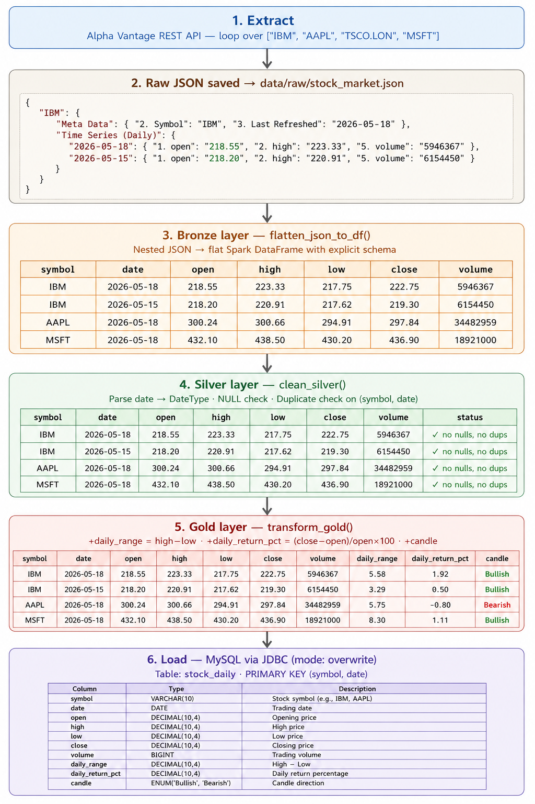

Medallion Architecture-Based Stock Market Data Pipeline.
----------------------------------------------------------
This project is an end-to-end ETL pipeline built using PySpark and MySQL. The pipeline extracts stock market OHLCV data from the Alpha Vantage REST API, stores raw API responses in a Bronze layer, performs data cleansing and validation in a Silver layer, and applies business transformations in a Gold layer before loading the final analytics-ready data into MySQL using JDBC.

The project follows Medallion Architecture and uses modular components for extraction, transformation, loading, logging, and configuration management. I also implemented centralized logging, schema validation, duplicate checks, and externalized configuration handling for maintainability and scalability.


	
------------------------------------------------------------------------------------------------------
# This project demonstrates REAL engineering practices:

## API Extraction Layer

- Built a configurable multi-symbol extractor that loops over a symbol list (`IBM`, `AAPL`, `TSCO.LON`, `MSFT`) and appends each ticker to the base URL, making one API call per symbol without modifying any source code.

- Implemented three-level response validation to handle Alpha Vantage-specific error patterns:
  - Rate-limit messages embedded inside `200 OK` responses
  - Missing time-series keys
  - HTTP errors

  Used **continue-on-failure** logic so one failed symbol never crashes the entire pipeline.

- Persisted raw JSON to disk (**Bronze landing zone**) before any Spark processing, enabling reprocessing without re-hitting the API during transformation failures.

---

## PySpark Transformation — Medallion Architecture

### Bronze Layer

- Wrote a custom Python flattener `flatten_json_to_df()` to unroll 3-level nested JSON:

  ```text
  symbol → date → OHLCV
  ```

- Converted nested API payloads into a flat Spark DataFrame using an explicit schema.

- Bypassed `spark.read.json()` because it incorrectly interpreted top-level symbol keys as column names.

---

### Silver Layer

- Parsed ISO date strings into Spark `DateType`.

- Executed per-column NULL validation across all OHLCV fields.

- Validated composite-key uniqueness on:

  ```text
  (symbol, date)
  ```

- Logged warnings instead of silently dropping records to preserve auditability.

---

### Gold Layer

- Engineered analytical columns:

| Derived Column | Description |
|---|---|
| `daily_range` | Intraday volatility |
| `daily_return_pct` | Open-to-close percentage change |
| `candle_direction` | Bullish / Bearish trend |

- Implemented transformations using PySpark functions:
  - `round()`
  - `when()`
  - `col()`

---

## Data Loading

- Configured JDBC write to MySQL using the `mysql-connector-j` driver JAR.

- Targeted a relational schema with:
  - `DECIMAL(10,4)` price columns
  - `BIGINT` volume
  - `ENUM` candle direction
  - Composite `PRIMARY KEY (symbol, date)`

- Enforced uniqueness at the database layer.

- Wrapped JDBC writes in:

  ```python
  try:
      ...
  except Exception:
      ...
  ```

- Enabled `exc_info=True` logging to capture complete stack traces during JDBC failures.

- Re-raised exceptions to ensure the pipeline exits with a non-zero status code for upstream orchestration monitoring.

---

## Pipeline Architecture & Engineering Practices

### Modular Architecture

- Designed a modular project structure:

  ```text
  extractor/
  transformer/
  loader/
  utils/
  ```

- Followed single-responsibility principles for easier maintenance, testing, and extensibility.

---

### Centralized Configuration

- Centralized all runtime configuration in a single `config.json`:

| Configuration Type | Examples |
|---|---|
| Spark Settings | Executor & session configs |
| JDBC Credentials | URL, username, password |
| API Configuration | Base URL, API key |
| Symbols | Stock ticker list |
| File Paths | Bronze/Silver/Gold paths |

- Adding a new stock symbol requires only a one-line configuration change with zero source-code modification.

---

### Logging Framework

- Built a shared logging utility:

  ```python
  get_logger(__name__)
  ```

- Enabled:
  - Timestamped logs
  - Module-level log identification
  - Simultaneous console + file logging
  - Duplicate-handler protection for multi-import safety

---

### Environment Setup

- Configured PySpark environment variables before `SparkSession` initialization:

  ```bash
  PYSPARK_PYTHON
  PYSPARK_DRIVER_PYTHON
  ```

- Added dynamic `PROJECT_ROOT` path injection using `sys.path`.

- Ensured the pipeline executes correctly from any working directory.


<p align="center">
  
</p>

## TECHNOLOGIES USED

| Category | Tools / Technologies |
|---|---|
| Languages | Python 3.10 |
| Big Data | Apache PySpark (SparkSession, DataFrame API, Window functions) |
| Data Source | Alpha Vantage REST API (TIME_SERIES_DAILY endpoint) |
| Database | MySQL 8 via JDBC (mysql-connector-j-9.3.0) |
| Data Format | JSON (raw), Parquet-compatible flat schema (processed) |
| Architecture | Medallion Architecture — Bronze / Silver / Gold layers |
| Logging | Python logging module — file + console dual handler |
| Configuration | JSON-driven config (zero hardcoded values in source code) |
| Dev Environment | Windows 10, Python venv, PyCharm |


